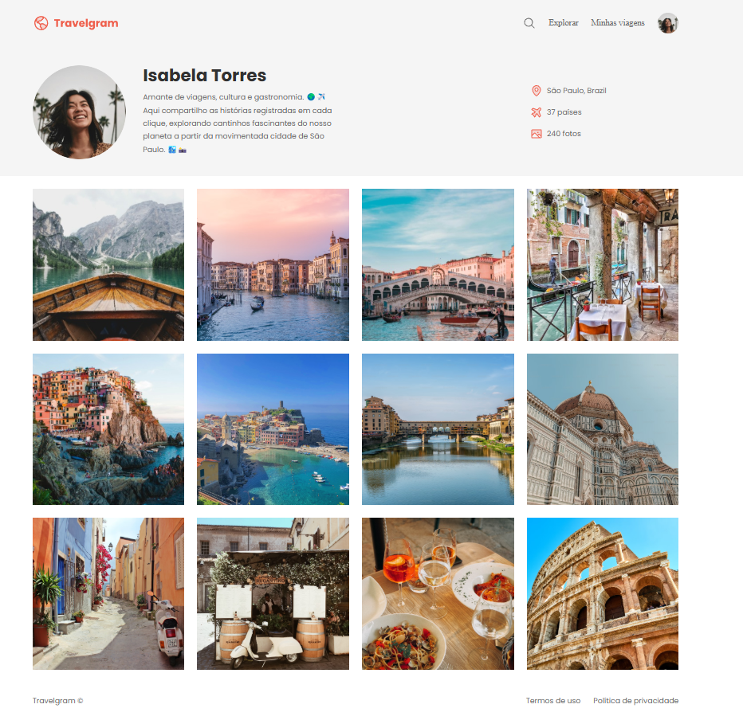

# travelgram

> Formação Full-Stack: Avançando no HTML e CSS (desafio prático)

O projeto é uma simples página de um perfil de viagens

[🔗 Clique aqui para acessar](https://natanjalmeida99.github.io/travelgram/)

## 🛠️ Tecnologias

- HTML
- CSS (FlexBox)
- Git e Github

## 💚 Contato

natanalmeida158@hotmail.com

---

Feito com ♥ by Rocketseat :wave: [Participe da nossa comunidade!](https://discord.gg/rocketseat)
